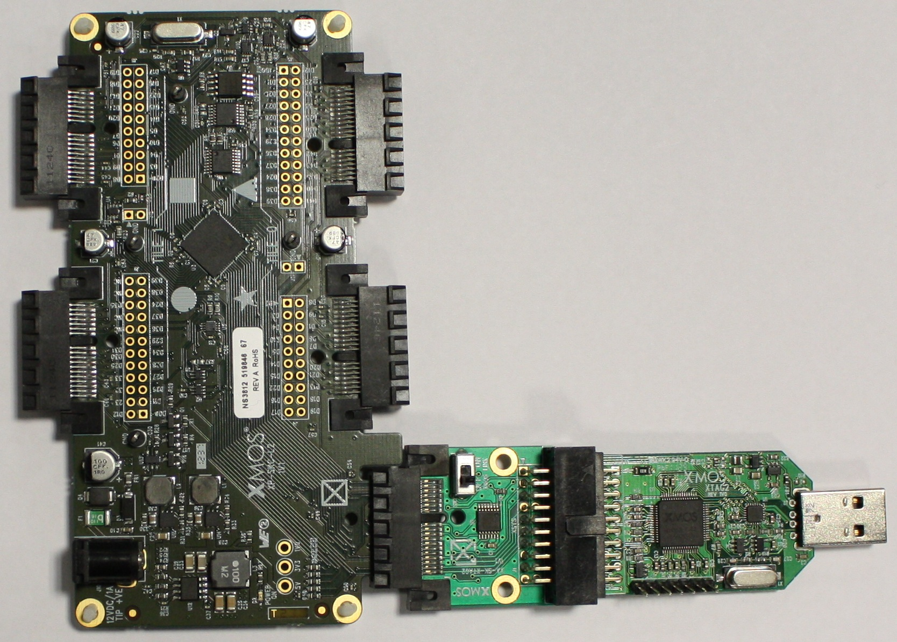

SPI Master Example Application: Quick Start Guide
=================================================

This simple demonstration of xTIMEcomposer Studio functionality uses the XP-SKC-L2 Slicekit L2 Core Board together with the xSOFTip ``module_spi_master`` to demonstrate how the module is used to communicate with an SPI slave device, the SPI flash device on the board (M25P16 flash).

Note: Running this program will overwrite any existing data in the flash.

Hardware Setup
--------------

The following hardware components are required:

* XTAG-2 (XTAG Connector Board)
* XA-SK-XTAG2 (Slicekit XTAG Adaptor)
* XP-SKC-L2 (Slicekit L2 Core Board)

XP-SKC-L2 Slicekit Core board has four slots with edge conectors: SQUARE, CIRCLE, TRIANGLE and STAR, and one chain connector marked with a CROSS.

To setup up the system:

#. Connect XTAG-2 to the XA-SK-XTAG2.
#. Connect XA-SK-XTAG2 to the XP-SKC-L2 using the port marked ``CROSS``.
#. Set the ``XMOS LINK`` to ``OFF`` on the XA-SK-XTAG2.
#. Connect the XTAG-2 to host PC. Note that the USB cable is not provided with the Slicekit starter kit.
#. Switch on the power supply to the Slicekit Core board.

   Hardware Setup for SPI Master Example Application

Import and Build the Application
--------------------------------

#. Open xTIMEcomposer.
#. Open the edit perspective (Window->Open Perspective->XMOS Edit).
#. Locate the ``SPI Master Example Application`` item in the xSOFTip pane on the bottom left of the window, and drag it into the Project Explorer window in the xTIMEcomposer.
#. This will also cause the modules on which this application depends to be imported as well.
#. This application depends on ``module_spi_master`` only.
#. Click on the app_spi_master_demo item in the Explorer pane then click on the build icon (hammer) in xTIMEcomposer.
#. Check the console window to verify that the application has built successfully.

For help in using xTIMEcomposer, try the xTIMEcomposer tutorial, which you can find by selecting Help->Tutorials from the xTIMEcomposer menu.

Note that the Developer Column in the xTIMEcomposer on the right hand side of your screen provides information on the xSOFTip components you are using. Select a module in the Project Explorer, and you will see its description together with API documentation. Having done this, click the `back` icon until you return to this quickstart guide within the Developer Column.

Run the Application
-------------------

Now that the application has been compiled, the next step is to run it on the Slicekit Core Board using the tools to load the application over JTAG (via the XTAG2 and Xtag Adaptor card) into the xCORE multicore microcontroller.

#. Select the file ``spi_master_demo.xc`` in the ``app_spi_master_demo`` project from the Project Explorer.
#. Click on the ``Run`` icon (the white arrow in the green circle).
#. At the ``Select Device`` dialog select ``XMOS XTAG-2 connect to L1[0..1]`` and click ``OK``.

The output to the console should show the SPI mode and frequency, 
		the onboard flash JEDEC data, and the results of write and read speed tests.

Next Steps
----------

#. Examine the application code. In xTIMEcomposer navigate to the ``src`` directory under app_spi_master_demo and double click on the ``spi_master_demo.xc`` file within it. The file will open in the central editor window.
#. Trying changing the ``DEFAULT_SPI_CLOCK_DIV`` define on line 6 of ``spi_conf.h`` to run a different SPI frequency, a value of ``50`` will result in a 1MHz SPI clock.

Try Related Applications
------------------------

#. app_spi_loopback_demo

